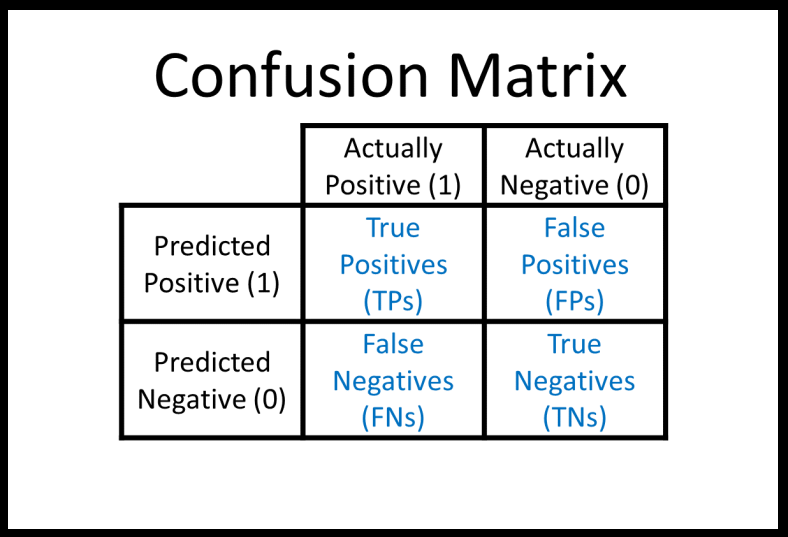
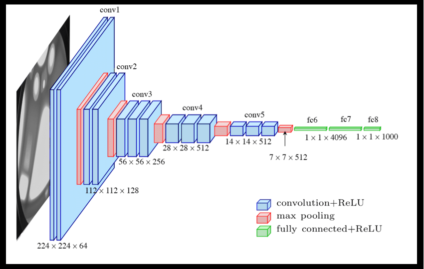
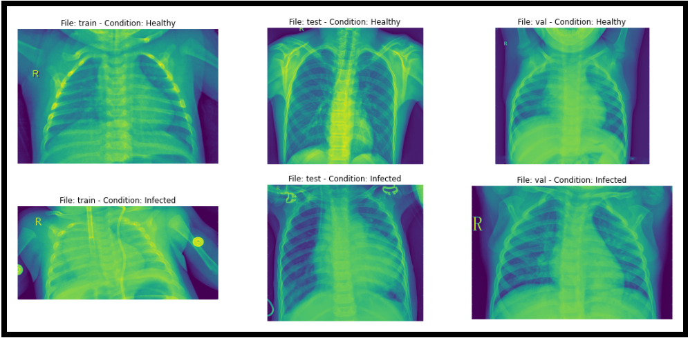
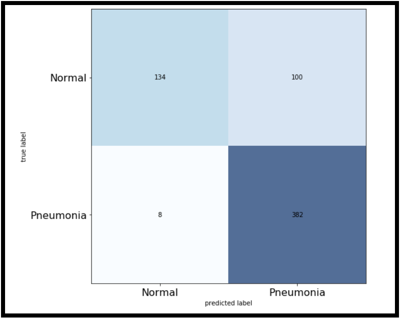
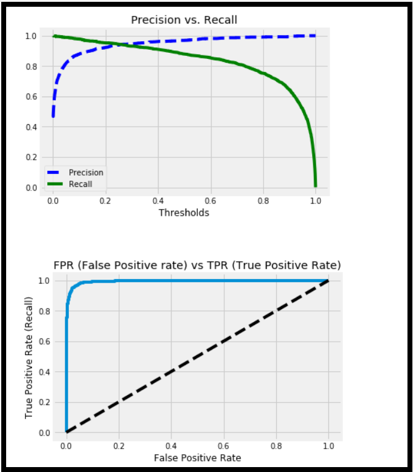
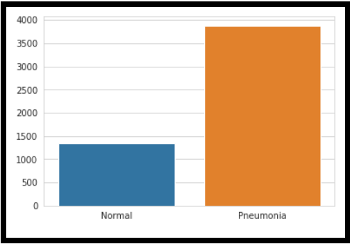

# SAMHAR-COVID19-Hackathon

<h1> Team Name : Xerphons </h1> 

This repository contains the final model, trained by our team.Currenly it works for Pneumonia Diagnosis, and a new model for Coronavirus will be trained in the hackathon.

The submission of our project COVID-X is as follows:

Github: 
Project Model Code for Pneumonia Diagnosis 
Instructions for running the model 

Google Drive Link: 
Main Project Presentation, with CNN architecture and Use Case Diagram 
Video demonstrating the Project 
Front End and Backend Code 

<html>
<h1> Instructions for running the model;</h1>

Requirements: 

Tensorflow 2.0 

Numpy 
Glob 
Matplotlib 
  <h1>Procedure:</h1> 

  Download the dataset from : https://www.kaggle.com/paultimothymooney/chest-xray-pneumonia 
  Run the model.py  
  Run the run.py 

<h1>THEORY:</h1> 
  <h3>This confusion matrix, presents the core metric of testing medical AI diagnostics. Unlike usual data analytics, in medicinal applications, recall is the true metric over accuracy, as in laymans terms it is more dangerous to detect COVID 19 in a person falsely, than to give a negative diagnosis, falsely.</h3> 
   
   <h3>This confusion matrix, presents the core metric of testing medical AI diagnostics. Unlike usual data analytics, in medicinal applications, recall is the true metric over accuracy, as in laymans terms it is more dangerous to detect COVID 19 in a person falsely, than to give a negative diagnosis, falsely.</h3> 
    
   <h3>This confusion matrix, presents the core metric of testing medical AI diagnostics. Unlike usual data analytics, in medicinal applications, recall is the true metric over accuracy, as in laymans terms it is more dangerous to detect COVID 19 in a person falsely, than to give a negative diagnosis, falsely.</h3> 
  
  
   <h3>This confusion matrix, presents the core metric of testing medical AI diagnostics. Unlike usual data analytics, in medicinal applications, recall is the true metric over accuracy, as in laymans terms it is more dangerous to detect COVID 19 in a person falsely, than to give a negative diagnosis, falsely.</h3> 
  
    
   <h3>This confusion matrix, presents the core metric of testing medical AI diagnostics. Unlike usual data analytics, in medicinal applications, recall is the true metric over accuracy, as in laymans terms it is more dangerous to detect COVID 19 in a person falsely, than to give a negative diagnosis, falsely.</h3> 
  
    
   <h3>This confusion matrix, presents the core metric of testing medical AI diagnostics. Unlike usual data analytics, in medicinal applications, recall is the true metric over accuracy, as in laymans terms it is more dangerous to detect COVID 19 in a person falsely, than to give a negative diagnosis, falsely.</h3> 
  
    
  
  
</html>
